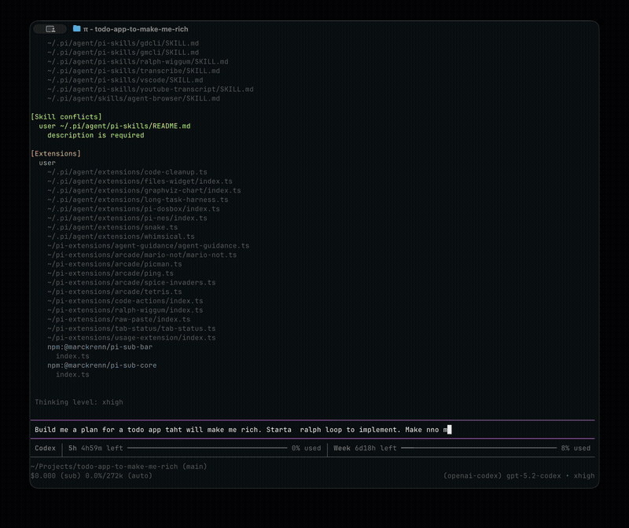

# pi-nes

Play NES games in your terminal. A [pi](https://github.com/mariozechner/pi) extension that runs a full NES emulator with Kitty graphics support.



## Installation

```bash
pi install npm:@tmustier/pi-nes
```

Or from git:
```bash
pi install git:github.com/tmustier/pi-nes
```

## Quick Start

```bash
/nes              # Pick a ROM from your library
/nes ~/roms/smb.nes   # Load a specific ROM
```

On first run, you'll be prompted to set your ROM directory and display quality. When launching `/nes` without a path, type to filter the ROM list while you navigate.

## Controls

### Game Controls

| Action | Keys |
|--------|------|
| D-pad | Arrow keys or WASD |
| A button | Z |
| B button | X |
| Start | Enter or Space |
| Select | Tab |

### Emulator Controls

| Action | Key |
|--------|-----|
| Detach (keep running) | Ctrl+Q |
| Quit | Q |

**Tip:** Detach with `Ctrl+Q` to return to pi, then run `/nes` to reattach to your game.

## Commands

| Command | Description |
|---------|-------------|
| `/nes` | Pick a ROM or reattach to running session |
| `/nes <path>` | Load a specific ROM file |
| `/nes config` | Quick setup (ROM directory + audio) |
| `/nes-config` | Toggle audio, quality, and display style + advanced options |
| `/nes debug` | Show FPS and memory stats |

## Configuration

Config is stored at `~/.pi/nes/config.json`. Use `/nes config` for quick setup (ROM dir + audio), or `/nes-config` to toggle audio/quality/style inline and access advanced options.

```json
{
  "romDir": "/roms/nes",
  "saveDir": "/roms/nes/saves",
  "renderer": "image",
  "imageQuality": "balanced",
  "videoFilter": "ntsc-composite",
  "enableAudio": false,
  "pixelScale": 1.0,
  "keybindings": {
    "up": ["up", "w"],
    "down": ["down", "s"],
    "left": ["left", "a"],
    "right": ["right", "d"],
    "a": ["z"],
    "b": ["x"],
    "start": ["enter", "space"],
    "select": ["tab"]
  }
}
```

### Options

| Option | Default | Description |
|--------|---------|-------------|
| `romDir` | `/roms/nes` | Where to look for ROM files |
| `saveDir` | `/roms/nes/saves` | Where to store battery saves (defaults to `<romDir>/saves`) |
| `renderer` | `"image"` | `"image"` (Kitty graphics) or `"text"` (ANSI) |
| `imageQuality` | `"balanced"` | `"balanced"` (30 fps) or `"high"` (60 fps) |
| `videoFilter` | `"ntsc-composite"` | `"off"`, `"ntsc-composite"`, `"ntsc-svideo"`, `"ntsc-rgb"` |
| `enableAudio` | `false` | Enable audio output (requires native core built with `audio-cpal`) |
| `pixelScale` | `1.0` | Display scale (0.5–4.0) |

`videoFilter` applies a lightweight CRT/NTSC-inspired pass (horizontal bleed + scanlines). It runs in the native core and is optional.

## Saves

Battery-backed SRAM is saved to `<saveDir>/<rom-name>-<hash>.sav` where the hash is derived from the full ROM path to avoid collisions. Old `<rom-name>.sav` files are ignored.

Saves are flushed on quit and periodically during play.

## Terminal Support

**Best experience:** a Kitty-protocol terminal like Ghostty, Kitty, or WezTerm (image protocol + key-up events).

- **Kitty-protocol terminals** — Full graphics via image protocol (shared memory or file transport)
- **Other terminals** — Falls back to ANSI half-block characters (`▀▄`)

Set `"renderer": "text"` if you prefer the ANSI renderer or have display issues.

## Limitations

- **Audio is opt-in** — Requires building the native core with `audio-cpal` and setting `enableAudio: true`
- **No auto-save** — Save manually just like you would with the original NES (battery-backed SRAM)

## Vendored Dependencies

- `nes_rust` is vendored under `extensions/nes/native/nes-core/vendor/nes_rust`.
- Fork: https://github.com/tmustier/nes-rust (upstream: https://github.com/takahirox/nes-rust)
- Update helper: `scripts/update-vendor-nes-rust.sh`

---

## Building from Source

Requires Rust toolchain (cargo + rustc).

```bash
git clone https://github.com/tmustier/pi-nes
cd pi-nes
npm install

# Build the NES core (required)
cd extensions/nes/native/nes-core
npm install && npm run build

# Build the NES core with audio (optional)
npm run build:audio

# Build shared memory renderer (optional, faster on Kitty)
cd ../kitty-shm
npm install && npm run build
```

Run locally:
```bash
pi --extension /path/to/pi-nes
```
